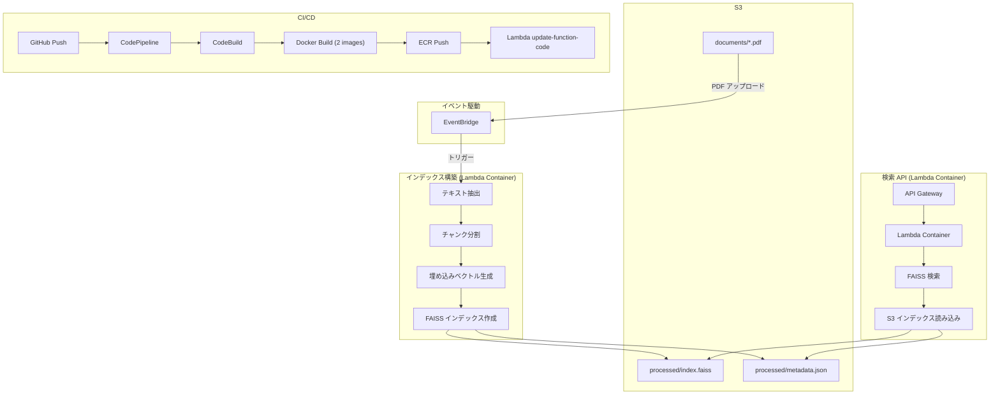
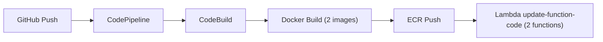

# vector-library

AWS Lambda + S3 + FAISS を用いた低コスト RAG 検索基盤。

## アーキテクチャ



## 技術スタック

| カテゴリ | 技術 |
|----------|------|
| 言語 | Python 3.14 |
| パッケージ管理 | uv |
| ベクトル検索 | FAISS (IndexFlatIP + cosine similarity) |
| 埋め込みモデル | sentence-transformers (all-MiniLM-L6-v2) |
| 推論ランタイム | PyTorch (CPU) |
| インフラ | AWS Lambda (Container) x2, API Gateway, S3, ECR, EventBridge |
| CI/CD | CodePipeline, CodeBuild, CodeConnections |
| IaC | CloudFormation |

## アプリケーション構成

| アプリケーション | 用途 | Dockerfile | ECR リポジトリ | Lambda 関数 |
|-----------------|------|------------|---------------|------------|
| rag_search_api | 検索 API | application/core/rag_search_api/Dockerfile | vl-{env}-search-api | vl-{env}-lambda-search-api |
| build_rag_index | インデックス構築 | application/core/build_rag_index/Dockerfile | vl-{env}-build-index | vl-{env}-lambda-build-index |

## ディレクトリ構成

```
vector-library/
├── application/
│   └── core/
│       ├── build_rag_index/
│       │   ├── Dockerfile
│       │   ├── handler.py
│       │   ├── config.py
│       │   ├── exceptions.py
│       │   ├── builder.py
│       │   ├── chunker.py
│       │   └── pdf_extractor.py
│       └── rag_search_api/
│           ├── Dockerfile
│           ├── handler.py
│           ├── config.py
│           └── searcher.py
├── tests/
│   └── unit/
├── cloudformation/
│   ├── create_stacks.sh
│   ├── delete_stacks.sh
│   ├── exec_change_sets.sh
│   └── templates/
│       ├── iam-role/
│       ├── s3/
│       ├── ecr/
│       ├── lambda/
│       ├── apigateway/
│       ├── eventbridge/
│       ├── codebuild/
│       └── codepipeline/
├── buildspec.yml
├── pyproject.toml
└── Makefile
```

## セットアップ

### 前提条件

- Python 3.14
- uv
- Docker
- AWS CLI (SSO 設定済み)

### 開発環境

```bash
# セットアップ
make setup

# .env ファイルを編集
vi .env

# テスト実行
make test

# リント
make lint
```

### FAISS インデックス構築

S3 バケットの `documents/` に PDF をアップロードすると、EventBridge が自動的に `build_rag_index` Lambda を起動してインデックスを構築します。

```bash
aws s3 cp your-document.pdf s3://vl-dev-rag-data-<account-id>/documents/
```

S3 の `processed/` に `index.faiss` と `metadata.json` が自動生成されます。

手動で Lambda を呼び出すこともできます。

```bash
make invoke-build-index
```

## デプロイ

### CloudFormation スタック

SystemName: `vl`

```bash
# スタック新規作成 (dev 環境)
cd cloudformation
./create_stacks.sh dev

# スタック更新（変更セット）
./exec_change_sets.sh dev

# スタック削除
./delete_stacks.sh dev
```

> [!IMPORTANT]
> - 各シェルスクリプトは実行時に AWS SSO ログインを自動で行います。
> - `create_stacks.sh` 内の構築対象リソースのコメントアウトを解除して実行してください。
> - CodePipeline デプロイ前に GitHub 接続の ARN をパラメータファイルに設定してください。

### デプロイ順序

`create_stacks.sh` 内の実行順序:

1. `create_stack s3` — S3 バケット作成
2. `create_s3_directories` — `documents/`, `processed/` プレフィックス作成
3. `create_stack iam-role` — IAM ロール作成（Virginia にデプロイ）
4. `create_stack ecr` — ECR リポジトリ作成
5. `push_initial_images` — 初期 Docker イメージをビルド・プッシュ（Lambda スタック作成に必要）
6. `create_stack lambda` — Lambda 関数作成
7. `create_stack apigateway` — API Gateway 作成
8. `create_stack eventbridge` — EventBridge ルール作成
9. `create_stack codebuild` — CodeBuild プロジェクト作成
10. `create_stack codepipeline` — CodePipeline 作成

### スタック命名規則

```
{SystemName}-{EnvType}-{ServiceName}
```

例: `vl-dev-s3`, `vl-dev-lambda`, `vl-prod-codepipeline`

### Docker イメージの手動ビルド・プッシュ

```bash
# ビルド（--provenance=false は Makefile に設定済み）
make build-search-api
make build-build-index

# ECR ログイン
aws ecr get-login-password --region us-west-2 --profile Sandbox | \
    docker login --username AWS --password-stdin <account-id>.dkr.ecr.us-west-2.amazonaws.com

# search-api: タグ付け・プッシュ
docker tag vl-search-api:latest <account-id>.dkr.ecr.us-west-2.amazonaws.com/vl-dev-search-api:latest
docker push <account-id>.dkr.ecr.us-west-2.amazonaws.com/vl-dev-search-api:latest

# build-index: タグ付け・プッシュ
docker tag vl-build-index:latest <account-id>.dkr.ecr.us-west-2.amazonaws.com/vl-dev-build-index:latest
docker push <account-id>.dkr.ecr.us-west-2.amazonaws.com/vl-dev-build-index:latest

# Lambda 更新
aws lambda update-function-code \
    --function-name vl-dev-lambda-search-api \
    --image-uri <account-id>.dkr.ecr.us-west-2.amazonaws.com/vl-dev-search-api:latest \
    --profile Sandbox

aws lambda update-function-code \
    --function-name vl-dev-lambda-build-index \
    --image-uri <account-id>.dkr.ecr.us-west-2.amazonaws.com/vl-dev-build-index:latest \
    --profile Sandbox
```

## API 仕様

### 検索エンドポイント

```
POST /v1/search
```

#### リクエスト

```json
{
    "query": "検索したいテキスト",
    "top_k": 5
}
```

#### レスポンス

```json
{
    "data": {
        "query": "検索したいテキスト",
        "top_k": 5,
        "total": 3,
        "results": [
            {
                "chunk_id": "document.pdf#p1#c0",
                "text": "マッチしたテキスト...",
                "source": "document.pdf",
                "page": 1,
                "chunk_index": 0,
                "score": 0.95
            }
        ]
    },
    "request_id": "xxxxxxxx-xxxx-xxxx-xxxx-xxxxxxxxxxxx"
}
```

#### エラーレスポンス

```json
{
    "error": {
        "code": "VALIDATION_ERROR",
        "message": "query は必須の文字列パラメータです",
        "request_id": "xxxxxxxx-xxxx-xxxx-xxxx-xxxxxxxxxxxx"
    }
}
```

## チャンク ID フォーマット

```
{source}#p{page}#c{chunk}
```

- `source`: PDF ファイル名
- `page`: ページ番号（1始まり）
- `chunk`: チャンクインデックス（0始まり）

例: `manual.pdf#p3#c2` → manual.pdf の 3 ページ目の 3 番目のチャンク

## Claude Code MCP サーバー

本システムの RAG 検索 API を Claude Code の MCP サーバーとして利用できます。登録すると、Claude Code の全プロジェクトから検索ツールとして利用可能になります。

### 前提条件

- [Claude Code](https://docs.anthropic.com/en/docs/claude-code) インストール済み
- uv インストール済み
- API Gateway デプロイ済み（エンドポイント URL と API Key が必要）

### セットアップ

```bash
./setup_mcp.sh dev
```

スクリプトが AWS CLI で以下を自動取得し、MCP サーバーを登録します:

- API Gateway エンドポイント URL（CloudFormation エクスポートから取得）
- API Key（API Gateway から取得）

### 確認

```bash
# 登録済み MCP サーバー一覧
claude mcp list

# 詳細確認
claude mcp get vector-library
```

### 利用方法

Claude Code 内で自然言語で検索を依頼できます:

```
「vector-library の search ツールで 'Lambda Container デプロイ方法' を検索して」
```

### 削除

```bash
claude mcp remove vector-library --scope user
```

## CI/CD フロー



### GitHub 接続の作成

CodePipeline は GitHub との連携に CodeConnections（旧 CodeStar Connections）を使用します。
デプロイ前に接続を作成し、ARN を `codepipeline/dev-oregon-parameters.json` の `GitHubConnectionArn` に設定してください。

> [!NOTE]
> 公式リファレンス: [Create a connection to GitHub (AWS CodeConnections)](https://docs.aws.amazon.com/dtconsole/latest/userguide/connections-create-github.html)

**前提条件**
- GitHub アカウントを作成済みであること
- 対象リポジトリの所有者、または GitHub 組織の所有者であること

**手順**

1. AWS コンソールで [Developer Tools > Settings > Connections](https://us-west-2.console.aws.amazon.com/codesuite/settings/connections?region=us-west-2) を開く
2. **Create connection** をクリック
3. プロバイダーに **GitHub** を選択し、接続名を入力して **Connect to GitHub** をクリック
4. **Authorize AWS Connector for GitHub** をクリックして AWS にアクセスを許可
5. **Install a new app** をクリックし、対象の GitHub アカウント/組織を選択して **Install**
6. **Connect** をクリックして接続を完成

**接続 ARN の確認**

```bash
aws codeconnections list-connections --profile Sandbox --region us-west-2
```

**パラメータファイルの更新**

取得した ARN を `cloudformation/templates/codepipeline/dev-oregon-parameters.json` に設定:

```json
{
  "ParameterKey": "GitHubConnectionArn",
  "ParameterValue": "arn:aws:codeconnections:us-west-2:<account-id>:connection/<connection-id>"
}
```
